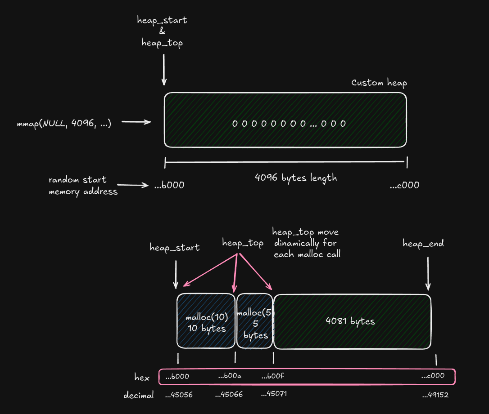
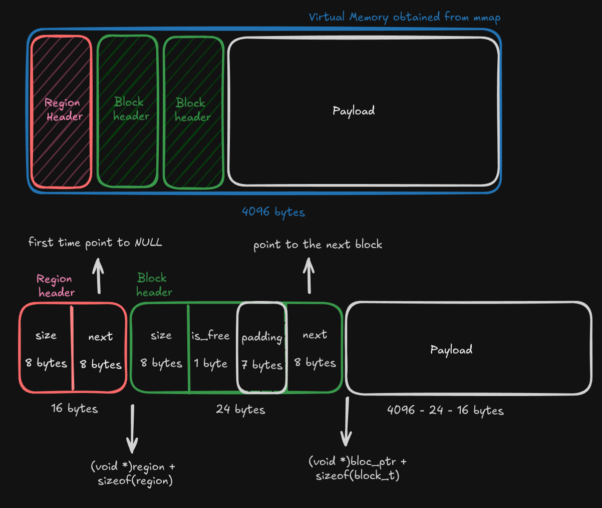
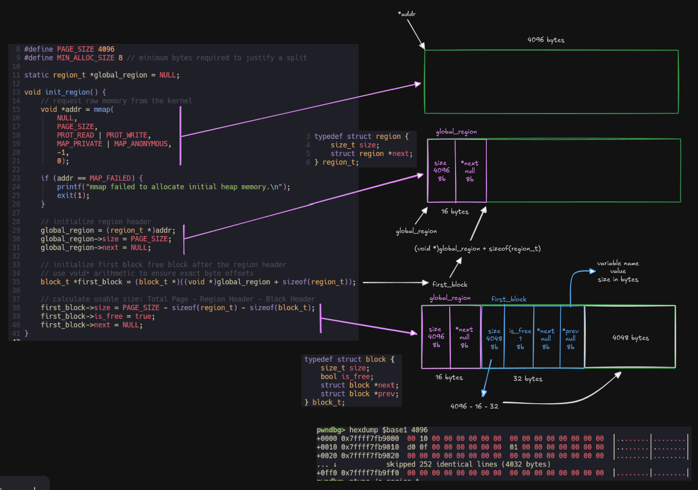
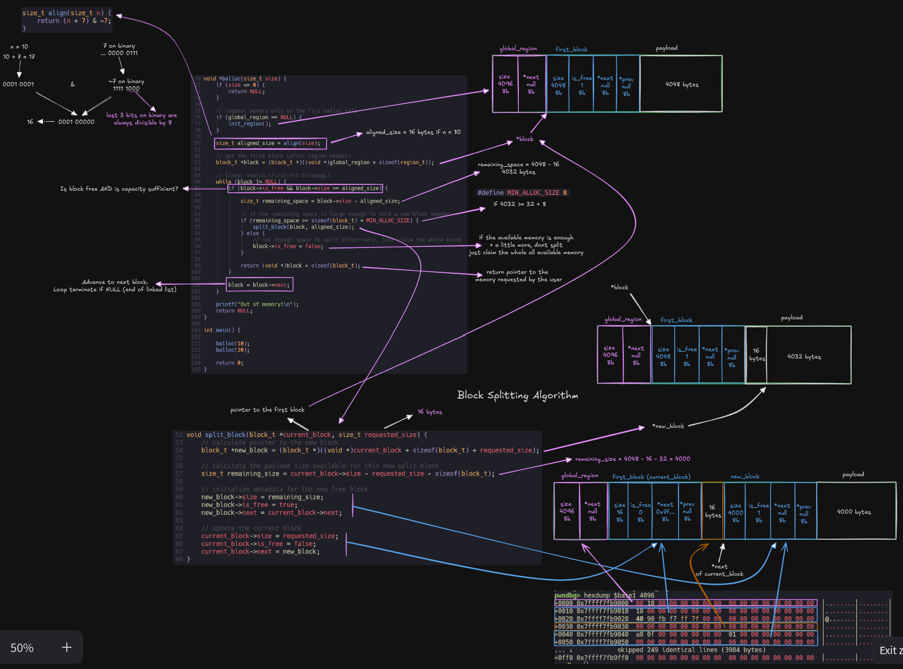

A Bad Memory Allocator built from scratch for learning purposes.

# Code Iterations

## 1° Iteration: Bump Allocator 

## 2° Iteration: First-Fit Linked List Allocator

## 3° Iteration: Block Splitting Algorithm

