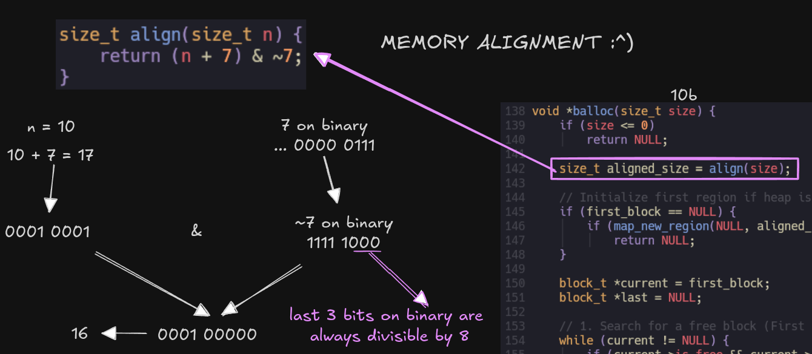
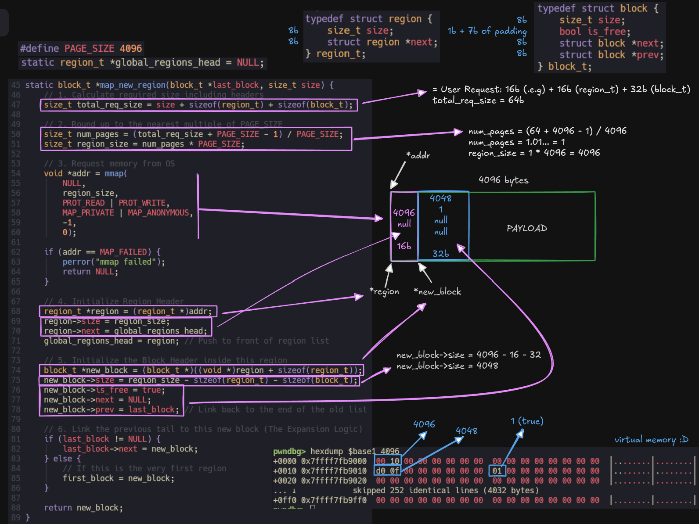
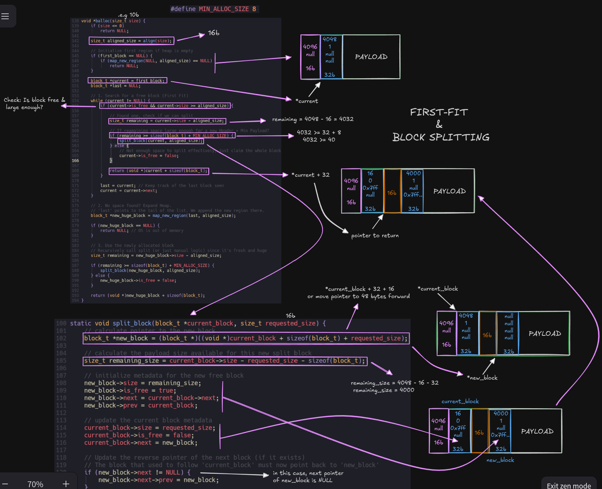
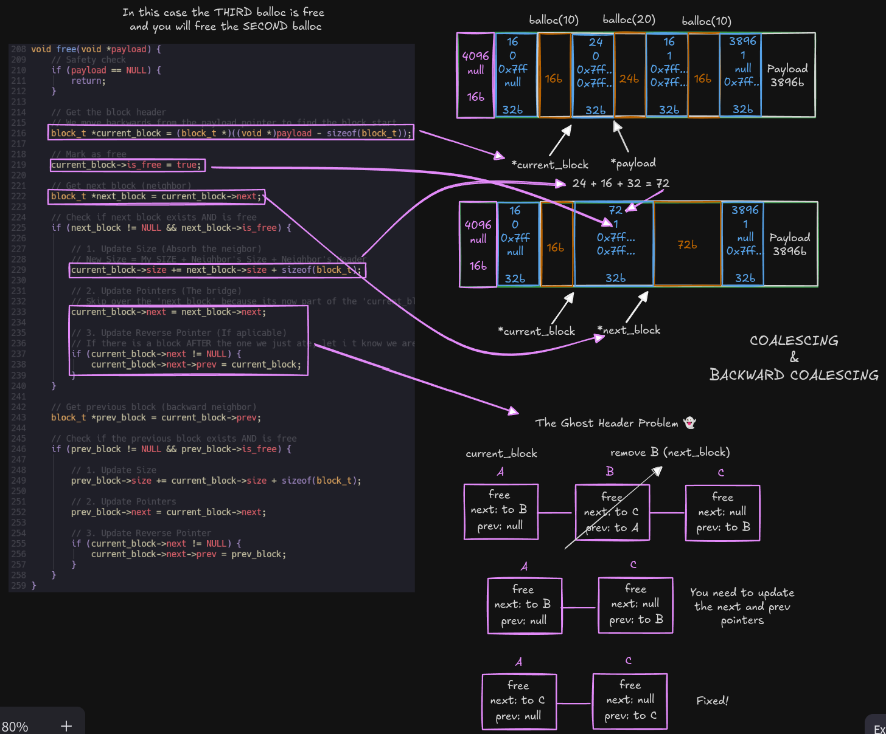
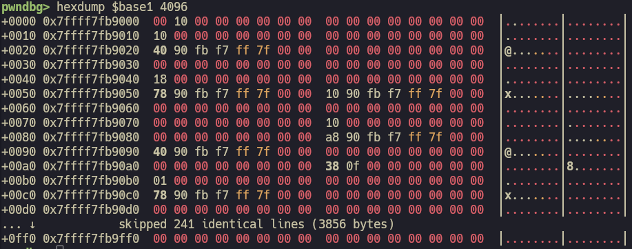

# Custom Memory Allocator in C

A Bad Memory Allocator built from scratch for learning purposes.

## 🚀 Key Concepts

This project was built to master the internals of computer memory. Key engineering concepts include:

* **Virtual Memory & Syscalls:** Direct interaction with the OS using `mmap` and `munmap` to request raw memory pages.
* **Data Structures:** Explicit implementation of **Doubly Linked Lists** embedded directly into the memory blocks (intrusive lists).
* **Algorithms:**
    * **First-Fit Strategy:** Linear scanning for the first available block that satisfies the request.
    * **Block Splitting:** Minimizing internal fragmentation by slicing large blocks into "used" and "free" segments.
    * **Coalescing (Merging):** Defeating external fragmentation by merging adjacent free blocks (both forward and backward).
* **Low-Level C:** Heavy use of **pointer arithmetic**, `void*` manipulation, and bitwise operations for strict **memory alignment** (8-byte boundary).

## 🧠 Internals & Implementation Details

Understanding a memory allocator requires visualizing the invisible. Below is a breakdown of the core 
strategies used in `Balloc`, from memory alignment to block coalescing.

### 1. Alignment (`align`)

To ensure CPU efficiency and avoid hardware exceptions, every memory request is aligned to 
**8 bytes** (64-bit architecture). We assume a "word size" of 8 bytes.

The `align()` helper uses bitwise manipulation to round up any number to the next multiple of 8:

- The Logic: `(size + 7) & ~7`
- The Result: Pointers returned to the user are always aligned, ensuring safe access to types like `long` or `double`.



### 2. Heap Expansion (`map_new_region`)

When the heap is initialized or runs out of space, we request fresh virtual memory pages from the OS using `mmap`.

- **Region Header:** Tracks the total size of the mapped area.
- **Block Header:** Implements the doubly linked list (`next`, `prev`) and metadata (`size`, `is_free`).
- **The Payload:** The actual raw memory available for allocation.

The initial block covers the entire remaining space of the page, creating 
a large, contiguous free block ready for splitting.



### 3. Allocation Strategy (`balloc` & `split_block`)

**Balloc** employs a **First-Fit** strategy with **Block Splitting** to manage memory efficiently.

When `balloc(size)` is called:

- **Traverse:** We scan the linked list for the first free block that satisfies `block->size >= aligned_size`.

- **Split:** If the found block is significantly larger than requested, we **split** it in two:
    - The first part becomes the **allocated block** (returned to the user).
    - The remaining part becomes a **new free block** (inserted into the list).

- **Return:** We return a pointer to the payload (skipping the metadata header).

> [!NOTE]
> Splitting only occurs if the remaining space is large enough to hold a new 
header plus a minimum payload. Otherwise, the entire block is allocated to avoid creating useless "splinters."



### 4. Deallocation & Coalescing (`free`)

The `free()` function is responsible for more than just marking a block as `is_free = true`. 
It fights fragmentation through **Coalescing**.

When a block is freed, we inspect its immediate neighbors (physically adjacent in memory):

- **Forward Coalescing:** If the next block is free, we merge with it.
- **Backward Coalescing:** If the prev block is free, we merge with it.

**The "Ghost Header" Concept:** During a merge, the header of the absorbed block is overwritten. 
It effectively ceases to exist as metadata and becomes part of the available payload of the 
new, larger block. This ensures that small freed chunks combine to form large contiguous regions 
for future big allocations.



## 🛠️ Installation & Usage

### Prerequisites
* GCC Compiler
* Make
* Linux/Unix environment (uses `mmap`)

### Building the Project
```bash
git clone https://github.com/a1nz2802/balloc.git
cd balloc
make
```

### Running Tests
The project includes a test suite validating reuse, alignment and heap expansion.

```
./allocator_test
```

### Debugging & Inspection (GDB/Pwndbg)
One of the main goals of this project was to verify logical concepts against physical RAM reality.

```bash
gdb ./allocator_test

gdb> break src/allocator.c:81
gdb> run

gdb> set $base1 = region
gdb> hexdump $base1 4096
```

and now you can see the memory!



### 📂 Project Structure

```txt
.
├── Makefile           # Build automation
├── include/
│   └── allocator.h    # Public API and Struct definitions
├── src/
│   ├── allocator.c    # Core logic (mmap, split, coalesce)
│   └── main.c         # Unit tests and usage examples
└── README.md          
```

### 🔮 Future Improvements

- [ ] Implement realloc.
- [ ] Add Thread Safety (Mutex locking).
- [ ] Implement munmap to return memory to the OS when large regions are empty.
- [ ] Optimize search with explicit Free Lists (Segregated Lists).

Made with ❤️ and C.
